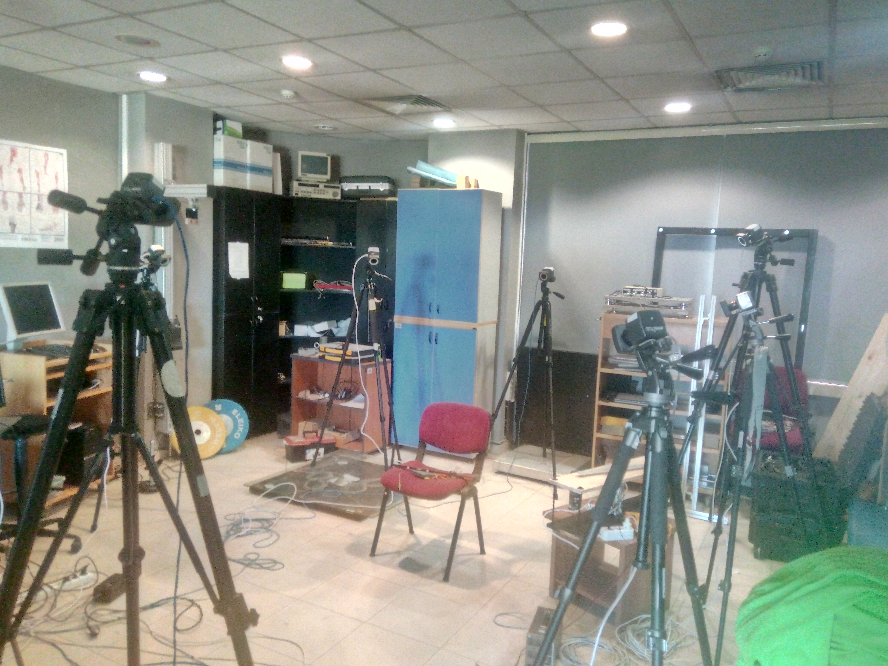
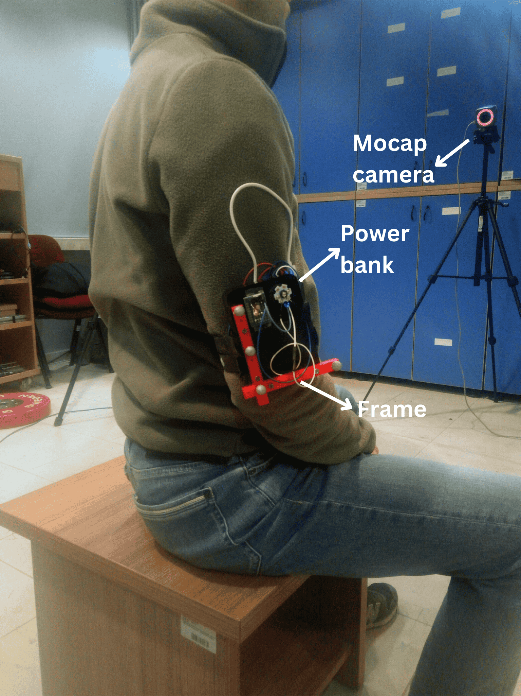
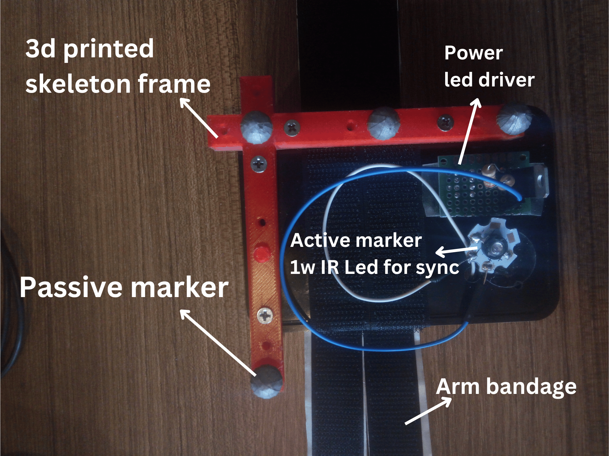

# IMU_Research
IMU and MOCAP research outputs

Mocap Setup (8 vicon bonito camera, vicon blade software 2.6.1

Arm setup (Bosch BMX160 IMU, 6 position calibrated, magnometer calibrated, Mocap sync with active marker)

|
|:-------------------------:|:-------------------------:|
|  |  |
