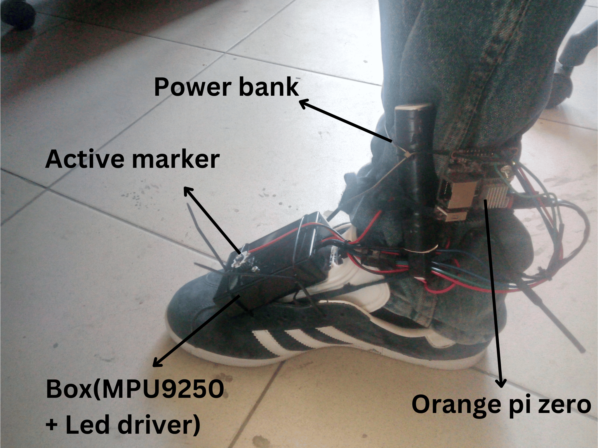
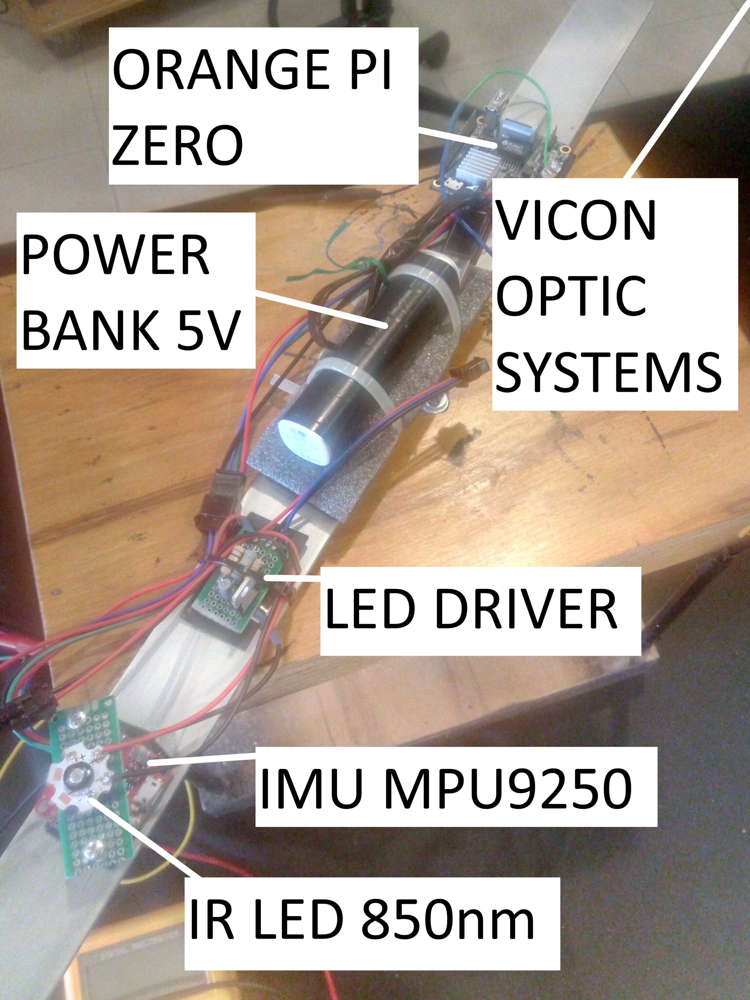
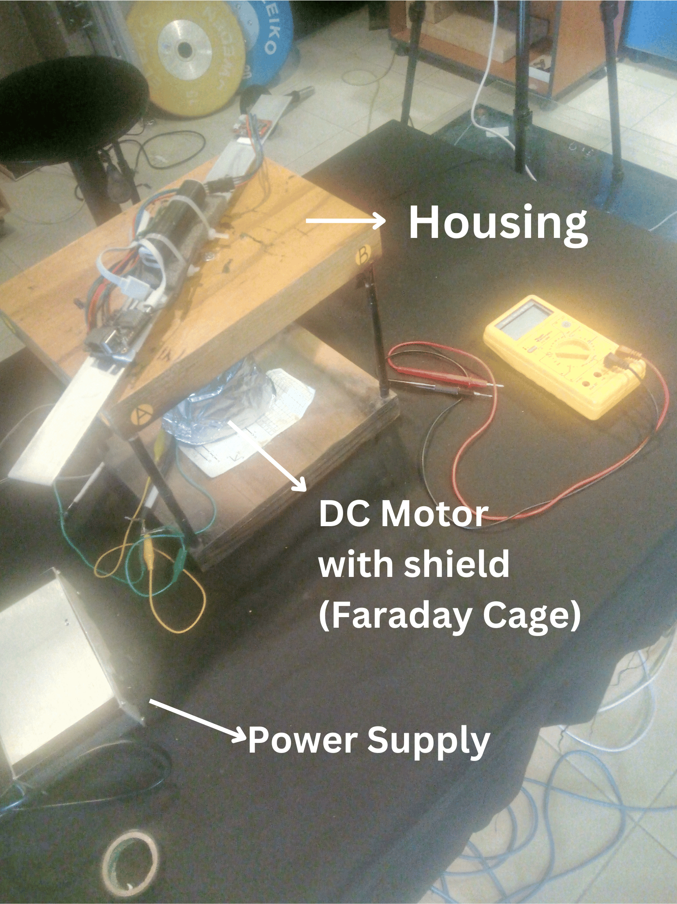
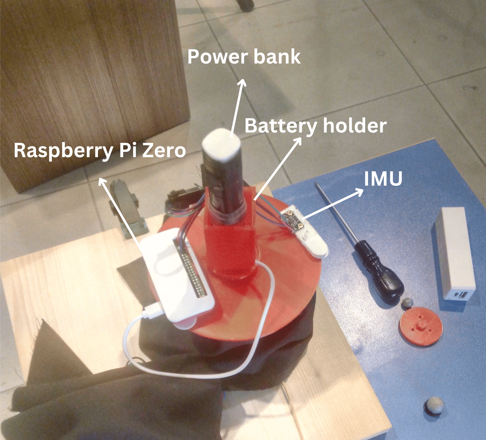
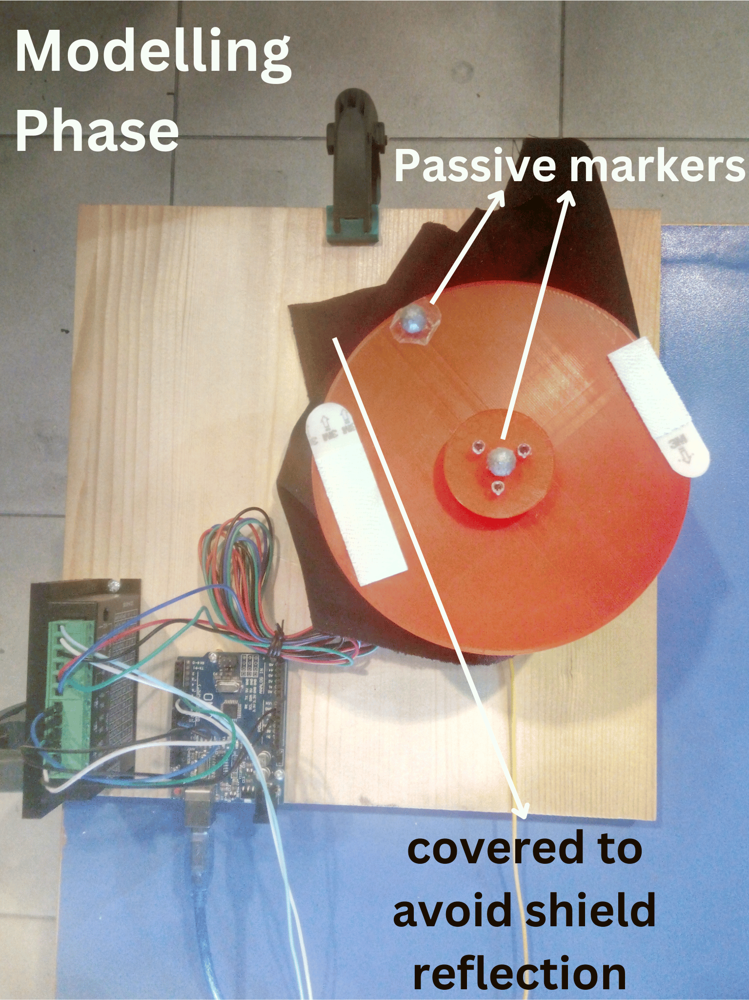
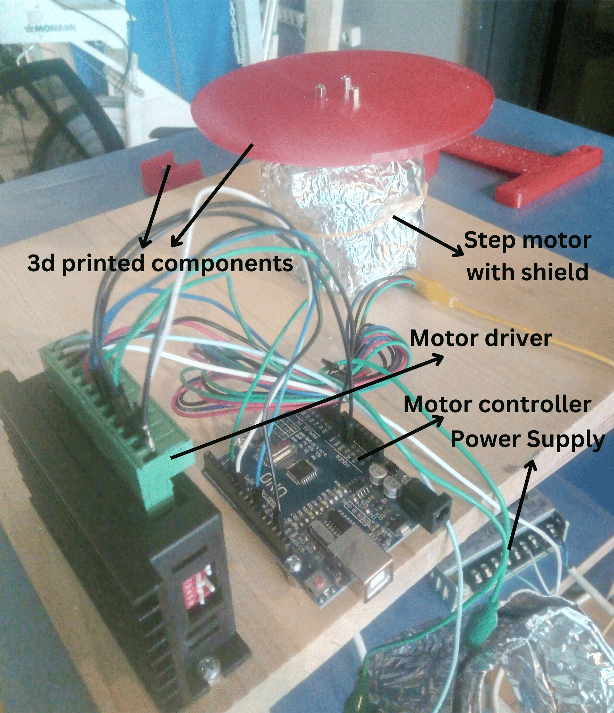

## Mocap Setup and Environment

# You can browse my reports by opening folders.

8 vicon bonito camera, vicon blade software 2.6.1

## Arm experiment setup
Bosch BMX160 IMU, Mocap sync with active marker

<table>
  <tr>
    <td></td>
    <td></td>
  </tr>
</table>

## Foot experiment setup
Invesense MPU9250 IMU, Mocap sync with active marker

## DC Motor Turn table experiment setup
Invesense MPU9250 IMU, Mocap sync with active marker

<table>
  <tr>
    <td></td>
    <td></td>
  </tr>
</table>

## Step Motor Turn table experiment setup
Bosch BMX160 IMU, Modelled by using Mocap data

<table>
  <tr>
    <td></td>
    <td></td>
  </tr>
  <tr>
    <td></td>
  </tr>
</table>

## Calibration stick experiment setup
Invesense MPU9250 IMU, Mocap sync with active marker

